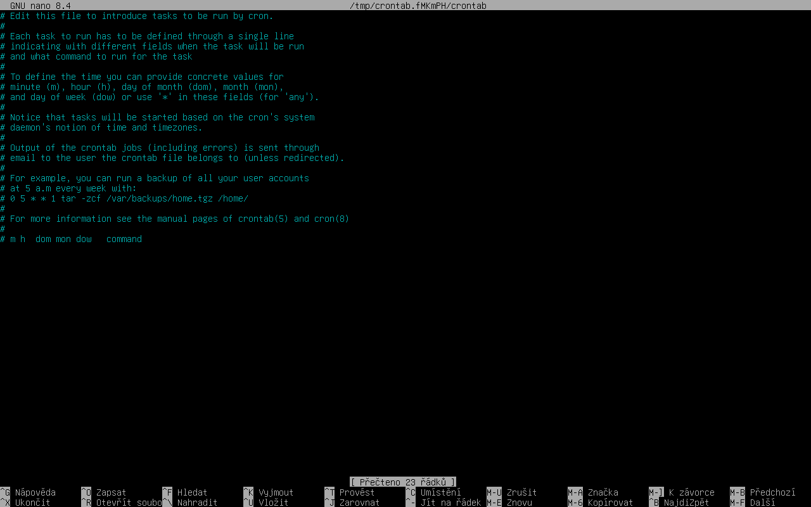

### Vytvoření skriptu

Nejprve vytvoříme soubor který bude jako skript pro zálohování:

```
touch zaloha_skript.sh
```

Dále otevřeme vytvořený soubor v textovém editoru:

```
nano zaloha_skript.sh
```

Následně definujeme výchozí shell skriptu:

```
#!/usr/bin/env bash
```

Vytvoření proměnné s cestou na zdrojovou složku:

```
#!/usr/bin/env bash

SOURCES="/home/user/test"
```

Vytvoření proměnné s cestou na cílovou složku, např.:

```
...
SOURCES="/home/user/test"
DEST="/home/user/zaloha"
```

Volitelně můžeme přidat prefix, který se aplikuje při vytváření názvu zálohy:

```
...
SOURCES="/home/user/test"
DEST="/home/user/zaloha"
PREFIX="$(hostname)-backup  # Volitelné
```

Nastavení rotace (kolik záloh):

```
...
SOURCES="/home/user/test"
DEST="/home/user/zaloha"
KEEP=7
```

Nastavení proměnné RSYNC pro zkopírování souborů včetně oprávnění a speciálních atributů:

```
...
SOURCES="/home/user/test"
DEST="/home/user/zaloha"
KEEP=7
RSYNC_OPTS="-aHAX --delete --info=progress2"
```

-a = "archivní režim" — zkopíruje složky rekurzivně a zachová většinu nastavení souborů (jako datum, oprávnění)

-H = zachová hardlinky (soubor, který má víc názvů)

-A = zachová ACL (pokud má soubor podrobnější oprávnění)

-X = zachová rozšířené atributy (doplnkové metadata)

--delete = v cíli smaže soubory, které už ve zdroji nejsou (udrží cíl stejný jako zdroj)

--info=progress2 = ukáže přehledný průběh přenosu (jak to postupuje celkově)

Kontrola existence cílové složky:

```
...   # Proměnné nad kódem

if [ ! -d "$DEST" ]; then
  echo "Cílová složka $DEST neexistuje." >&2
  exit 2
fi
```

Vytvoření proměnné pro vytvoření koncovky souboru zaznamenávající čas:

```
...   # Proměnné nad kódem

if [ ! -d "$DEST" ]; then
  echo "Cílová složka $DEST neexistuje." >&2
  exit 2
fi

TIMESTAMP="$(date +%Y-%m-%d_%H%M%S)"
```

Vytvoření proměnné pro název vytvářející se zálohy:

```
...   # Proměnné nad kódem

if [ ! -d "$DEST" ]; then
  echo "Cílová složka $DEST neexistuje." >&2
  exit 2
fi

TIMESTAMP="$(date +%Y-%m-%d_%H%M%S)"
TMP_DEST="${DEST}/${PREFIX}-${TIMESTAMP}.inprogress"
```

Vytvoření proměnné pro název výsledné zálohy:

```
...   # Proměnné nad kódem

if [ ! -d "$DEST" ]; then
  echo "Cílová složka $DEST neexistuje." >&2
  exit 2
fi

TIMESTAMP="$(date +%Y-%m-%d_%H%M%S)"
TMP_DEST="${DEST}/${PREFIX}-${TIMESTAMP}.inprogress"
FINAL_DEST="${DEST}/${PREFIX}-${TIMESTAMP}"
```

Vytvoření složky pro dočasné uložení zálohy:

```
...

TIMESTAMP="$(date +%Y-%m-%d_%H%M%S)"
TMP_DEST="${DEST}/${PREFIX}-${TIMESTAMP}.inprogress"
FINAL_DEST="${DEST}/${PREFIX}-${TIMESTAMP}"

mkdir -p "$TMP_DEST"
```

Cyklus pro průchod všemi soubory zdrojové složky, které se mají zálohovat:

```
...

mkdir -p "$TMP_DEST"

for src in "${SOURCES[@]}"; do
  if [ ! -e "$src" ]; then
    echo "Varování: zdroj $src neexistuje — přeskočeno."
    continue
  fi
  rsync $RSYNC_OPTS "$src" "$TMP_DEST/"
done
```

Přejmenování dočasné složky na výslednou:

```
...

for src in "${SOURCES[@]}"; do
  if [ ! -e "$src" ]; then
    echo "Varování: zdroj $src neexistuje — přeskočeno."
    continue
  fi
  rsync $RSYNC_OPTS "$src" "$TMP_DEST/"
done

mv "$TMP_DEST" "$FINAL_DEST"
```

Ošetření ponechání posledních x záloh (definované pomocí proměnné KEEP):

```
...

mv "$TMP_DEST" "$FINAL_DEST"

cd "$DEST"
ls -1dt ${PREFIX}-* 2>/dev/null | sed -n "$((KEEP+1)),\$p" | while read -r old; do
  [ -z "$old" ] && break
  rm -rf -- "$old"
done
```

Oznámení o dokončení zálohy:

```
...

cd "$DEST"
ls -1dt ${PREFIX}-* 2>/dev/null | sed -n "$((KEEP+1)),\$p" | while read -r old; do
  [ -z "$old" ] && break
  rm -rf -- "$old"
done

echo "Záloha dokončena: $FINAL_DEST"
```

Ukončení skriptu:

```
...

echo "Záloha dokončena: $FINAL_DEST"

exit 0
```

Nakonec skript uložíme do souboru pomocí klávesové zkratky _Ctrl+S_ a z textového editoru odejdeme pomocí _Ctrl+X_.


### Nastavení cron-u pomocí crontabu

#### Co je crontab?
- Soubory crontab určují, které příkazy se mají spouštět a kdy.
- Na nastavení pravidelného spuštění příkazu přidáme nový řádek dle formátu:

```
minuty hodiny den_v_mesici mesic den_v_tydnu prikaz
```

**Rozsahy času**
  - minuty: 0–59
  - hodiny: 0–23
  - den_v_mesici: 1–31
  - mesic: 1–12 (nebo zkratky Jan–Dec)
  - den_v_tydnu: 0–7 (0 a 7 = neděle nebo zkratky Sun–Sat)

**Příklady**
- Každou minutu:
  * * * * * /cesta/k/úloze.sh
- Každou noc v 01:00:
  0 1 * * * /cesta/k/night_job.sh
- Každou neděli v 04:30:
  30 4 * * 0 /cesta/k/weekly.sh


Abychom mohli nastavit pravidelné spuštění příkazu, musíme otevřít _crontab_:

```
crontab -e
```


Objeví se textový editor, který by měl vypadat takhle:




---
[1]: https://crontab.guru
[2]: https://duck.ai
[3]: https://gemini.google.com
