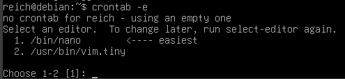

Tento návod vás provede vytvořením robustního zálohovacího skriptu v Bashi, který využívá nástroj `rsync` pro efektivní kopírování, podporuje verzování (rotaci) záloh a ošetřuje nedokončené přenosy.

---

Aby mohl tento skript správně fungovat, budete potřebovat následující softwarové vybavení. Většina z těchto nástrojů je v Linuxu standardní součástí systému, ale je dobré si ověřit jejich přítomnost.


# Potřebný software

1.  **Textový editor (nano):**
    *   Budeme používat textový editor `nano`, ale samozřejmě lze použít jakýkoliv jiný editor.
    *   Pokud jej nemáte, nainstalujete jej příkazem:
        *   *Debian/Ubuntu/Mint:* `sudo apt install nano`
        *   *Fedora/RHEL/CentOS:* `sudo dnf install nano`
        *   *Arch Linux:* `sudo pacman -S nano`
2.  **rsync:**
    *   Klíčový nástroj pro samotné kopírování a synchronizaci souborů.
    *   Pokud jej nemáte, nainstalujete jej příkazem:
        *   *Debian/Ubuntu/Mint:* `sudo apt install rsync`
        *   *Fedora/RHEL/CentOS:* `sudo dnf install rsync`
        *   *Arch Linux:* `sudo pacman -S rsync`
     
## Princip funkce rsyncu

Rsync (ze slov "Remote Synchronization") je inteligentní nástroj pro kopírování souborů, na rozdíl od běžného příkazu `cp`, který zkopíruje veškerá data, rsync pracuje přírustkově (inkrementálně). Před jakýmkoli přenosem nejprve zkontroluje, zda došlo ke změnám oproti poslední záloze. Pokud u daného souboru nedošlo k žádné změně, vytvoří pouze hardlink na soubor ve staré záloze. Pokud se však soubor změnil, rsync nejprve zkopíruje poslední verzi souboru z poslední zálohy na místo nového souboru. Následně pomocí svého algoritmu rozdělí pozměněný soubor a soubor z poslední zálohy na malé kousky, následně vytvoří kontrolní součty těchto bloků a porovná každý z nich s jeho protějškem z opačného souboru, pokud se kontrolní součet liší, blok souboru z poslední zálohy bude nahrazen blokem pozměného souboru. Pozměněný soubor, který je již nyní zazálohován bude na disku zabírat nový prostor, nicméně stačilo přenést pouze zlomek informací z místa, kde se nacházel originál (což může hrát velkou roli při provádění záloh na vzdálený disk, kdy je objem přenosu podstatný).

## Jak ověřit, zda je vše připraveno?
Stačí do terminálu napsat:
```bash
rsync --version
```
Pokud se zobrazí verze programu, je vše v pořádku a můžete skript začít používat.

---

# Návod

## Vytvoření skriptu

### 1. Vytvoření a otevření souboru
Nejprve v terminálu vytvoříme nový soubor pro náš skript a otevřeme jej v textovém editoru (např. `nano`):

```bash
touch zaloha_skript.sh
nano zaloha_skript.sh
```

### 2. Definice proměnných a konfigurace
Do souboru vložíme úvodní řádku (shebang) a definujeme parametry zálohování.

```bash
#!/usr/bin/env bash

# --- KONFIGURACE ---
# Cesty ke složkám, které chceme zálohovat (doplňte zde vaši cestu k zdrojové složce)
SOURCES=("/cesta/k/zdroji")

# Cesta, kam se zálohy budou ukládat (musí existovat, doplňte vaši cestu k cílové složce)
DEST="/cesta/k/zaloze"

# Prefix názvu zálohy a počet zachovaných verzí
PREFIX="$(hostname)-backup"
KEEP=7

# Parametry pro RSYNC
# -a: archivní (zachová oprávnění, časy, rekurze)
# -H: zachová hardlinky
# -A: zachová ACL (přístupová práva)
# -X: zachová rozšířené atributy
# --delete: smaže v cíli soubory, které už nejsou ve zdroji
# --info=progress2: vypíše přehledné informace o celém procesu přenosu dat
RSYNC_OPTS="-aHAX --delete --info=progress2"
```

### 3. Kontrola prostředí a příprava názvů
Skript musí ověřit, zda cílová složka existuje, a připravit si časové razítko pro unikátní název každé zálohy.

```bash
# Kontrola existence cílové složky
if [ ! -d "$DEST" ]; then
  echo "Chyba: Cílová složka $DEST neexistuje." >&2
  exit 2
fi

# Vytvoření časového razítka a názvů složek
TIMESTAMP="$(date +%Y-%m-%d_%H%M%S)"
# Dočasná složka pro probíhající zálohu
TMP_DEST="${DEST}/${PREFIX}-${TIMESTAMP}.inprogress"
# Konečný název po úspěšném dokončení
FINAL_DEST="${DEST}/${PREFIX}-${TIMESTAMP}"
```

### 4. Nalezení předchozí zálohy pro pevné odkazy

Aby mohl rsync vytvářet inkrementální zálohy pomocí pevných odkazů (hardlinků), musí skript najít nejnovější dokončenou zálohu a předat ji příkazu jako referenci přes parametr `--link-dest`.

```bash
# Vyhledáme nejnovější existující složku zálohy (ignorujeme rozpracovanou .inprogress)
LATEST_BACKUP=$(ls -1dt "${DEST}/${PREFIX}-"* 2>/dev/null | grep -v "\.inprogress$" | head -n 1)

# Pokud předchozí úspěšná záloha existuje, přidáme ji do parametrů rsyncu jako referenci
if [ -n "$LATEST_BACKUP" ]; then
  RSYNC_OPTS="$RSYNC_OPTS --link-dest=$LATEST_BACKUP"
fi
```

### 5. Samotné zálohování (Smyčka a Rsync)
V této části vytvoříme dočasnou složku a postupně do ní pomocí rsync zkopírujeme všechny definované zdroje.

```bash
mkdir -p "$TMP_DEST"

for src in "${SOURCES[@]}"; do
  if [ ! -e "$src" ]; then
    echo "Varování: Zdroj $src neexistuje – přeskakuji."
    continue
  fi
  
  # Spuštění kopírování
  rsync $RSYNC_OPTS "$src" "$TMP_DEST/"
done

# Po úspěšném dokončení přejmenujeme dočasnou složku na finální
mv "$TMP_DEST" "$FINAL_DEST"
```

### 6. Rotace záloh (Mazání starých verzí)
Aby nedošlo k přeplnění disku, ponecháme pouze nastavený počet nejnovějších záloh (proměnná `KEEP`).

```bash
cd "$DEST"
# Seřadí složky podle času (nejnovější nahoře) a vybere ty k smazání
ls -1dt ${PREFIX}-* 2>/dev/null | sed -n "$((KEEP+1)),\$p" | while read -r old; do
  if [ -n "$old" ]; then
    echo "Mažu starou zálohu: $old"
    rm -rf -- "$old"
  fi
done

echo "Záloha dokončena: $FINAL_DEST"
exit 0
```

---


### Jak skript uložit a spustit

1.  **Uložení:** V editoru `nano` stiskněte `Ctrl+S` (uložit) a poté `Ctrl+X` (odejít).
2.  **Práva ke spuštění:** Aby bylo možné soubor spustit jako program, musíte mu přidat oprávnění:
    ```bash
    chmod +x zaloha_skript.sh
    ```
3.  **Spuštění:** Skript nyní můžete spustit příkazem:
    ```bash
    ./zaloha_skript.sh
    ```

---

### Celý skript pro zkopírování:

```bash
#!/usr/bin/env bash

# --- KONFIGURACE ---
SOURCES=("/cesta/k/zdroji") # Nezapomeňte změnit cestu k zdrojové složce!
DEST="/cesta/k/zaloze" # Nezapomeňte změnit cestu k cílové složce!
PREFIX="$(hostname)-backup"
KEEP=7
RSYNC_OPTS="-aHAX --delete --info=progress2"

# --- KONTROLA A PŘÍPRAVA ---
if [ ! -d "$DEST" ]; then
  echo "Chyba: Cílová složka $DEST neexistuje." >&2
  exit 2
fi

TIMESTAMP="$(date +%Y-%m-%d_%H%M%S)"
TMP_DEST="${DEST}/${PREFIX}-${TIMESTAMP}.inprogress"
FINAL_DEST="${DEST}/${PREFIX}-${TIMESTAMP}"

# --- NALEZENÍ POSLEDNÍ ZÁLOHY PRO HARDLINKY ---
LATEST_BACKUP=$(ls -1dt "${DEST}/${PREFIX}-"* 2>/dev/null | grep -v "\.inprogress$" | head -n 1)

if [ -n "$LATEST_BACKUP" ]; then
  RSYNC_OPTS="$RSYNC_OPTS --link-dest=$LATEST_BACKUP"
fi

# --- PROCES ZÁLOHOVÁNÍ ---
mkdir -p "$TMP_DEST"

for src in "${SOURCES[@]}"; do
  if [ ! -e "$src" ]; then
    echo "Varování: Zdroj $src neexistuje – přeskakuji."
    continue
  fi
  rsync $RSYNC_OPTS "$src" "$TMP_DEST/"
done

mv "$TMP_DEST" "$FINAL_DEST"

# --- ROTACE ZÁLOH ---
cd "$DEST"
ls -1dt ${PREFIX}-* 2>/dev/null | grep -v "\.inprogress$" | sed -n "$((KEEP+1)),\$p" | while read -r old; do
  [ -z "$old" ] && break
  rm -rf -- "$old"
done

echo "Záloha dokončena: $FINAL_DEST"
exit 0
```

---

## Nastavení cron-u pomocí crontabu

### Co je crontab?
- Soubory crontab určují, které příkazy se mají spouštět a kdy.
- Na nastavení pravidelného spuštění příkazu přidáme nový řádek dle formátu:

```
minuty hodiny den_v_mesici mesic den_v_tydnu prikaz
```

**Rozsahy času**
  - minuty: 0–59
  - hodiny: 0–23
  - den_v_mesici: 1–31
  - mesic: 1–12 (nebo anglicky zkratky Jan–Dec)
  - den_v_tydnu: 0–7 (0 a 7 = neděle nebo zkratky Sun–Sat)

**Příklady**
- Každou noc v 01:00:
  ```
  0 1 * * * /cesta/k/zaloha_skript.sh
  ```
- Každou neděli v 04:30:
  ```
  30 4 * * 0 /cesta/k/zaloha_skript.sh
  ```

---

### Jak na to?

Abychom mohli nastavit pravidelné spuštění příkazu, musíme otevřít `crontab`:

```bash
crontab -e
```

Pokud poprvé spouštíte tento příkaz a máte více textových editorů nainstalováno, zobrazí se vám tento text:



Nabízí vám, jaký textový editor chcete používat při konfiguraci cron-u. V návodu již používáme `nano`,  takže vybereme číslo, kde se editor nabízí (v obrázku číslo 1).

*Pozn.: Samozřejmě lze pokračovat i v jiném textovém editoru.*

---

Objeví se textový editor, který by měl vypadat takhle:


Zde budeme vkládat naše pravidelné spouštění zálohovacího skriptu.

V editoru umístíme kurzor na konec dokumentu (pokud existují nějaké komentáře, umístíme se za ně) a napíšeme nový řádek pro spuštění našeho skriptu. V našem případě chceme nastavit skript, aby se spustil každou minutu.

```bash
# --- Cestu ke skriptu si změňte podle vašeho umístění ---
* * * * * /cesta/k/zaloha_skript.sh
```

**Rozklad záznamu:**
- `*` – každá minuta (0–59)
- `*` – každá hodina (0–23)
- `*` – každý den v měsíci (1–31)
- `*` – každý měsíc (1–12)
- `*` – každý den v týdnu (0–7, kde 0 a 7 = neděle)
- `/cesta/k/zaloha_skript.sh` – absolutní cesta k našemu skriptu

### Uložení a zavření editoru

Po vložení řádku s příkazem uložte soubor:
1. Stiskněte `Ctrl+S` (nebo zadejte název souboru, pokud je to poprvé)
2. Stiskněte `Enter` (potvrzení)
3. Stiskněte `Ctrl+X` (zavření editoru)

### Ověření nastavení

Po uložení se vrátíte do terminálu. Chcete-li ověřit, že je cron job správně nastaven, zadejte příkaz:

```bash
crontab -l
```

Tento příkaz vypíše všechny nastavené úlohy. Měli byste vidět váš záznam s cestou k zálohovacímu skriptu.

### Kontrola logu cron-u

Cron zaznamenává své aktivity. V závislosti na vašem Linuxovém systému jej najdete v:

- **/var/log/syslog** (Debian, Ubuntu, Linux Mint)
  ```bash
  grep CRON /var/log/syslog
  ```

- **/var/log/cron** (Fedora, RHEL, CentOS)
  ```bash
  sudo tail -f /var/log/cron
  ```

Pokud se skript spustil, měli byste vidět záznam podobný:

```
Jun  8 12:05:01 hostname CRON[12345]: (user) CMD (/cesta/k/zaloha_skript.sh)
```

### Řešení běžných problémů

| Problém | Řešení |
|---------|--------|
| Skript se nespustí | Ověřte absolutní cestu ke skriptu a práva (`chmod +x`) |
| Práva odmítnutá | Přidejte schválení v sudo (`sudo crontab -e`) |
| Cron je vypnutý | Ujistěte se, že služba běží: `sudo systemctl status cron` |

### Vypnutí nebo úprava úlohy

Chcete-li úlohu upravit nebo vypnout, opět spusťte:

```bash
crontab -e
```

Můžete řádek:
- **Upravit** – změnit časy nebo cestu
- **Zakomentovat** – přidat `#` na začátek řádku (úloha se nebude spouštět)
- **Smazat** – odstranit řádek úplně

Pro smazání všech cron úloh (pozor – nevratné!):

```bash
crontab -r
```

---
[1]: https://crontab.guru
[2]: https://duck.ai
[3]: https://gemini.google.com
